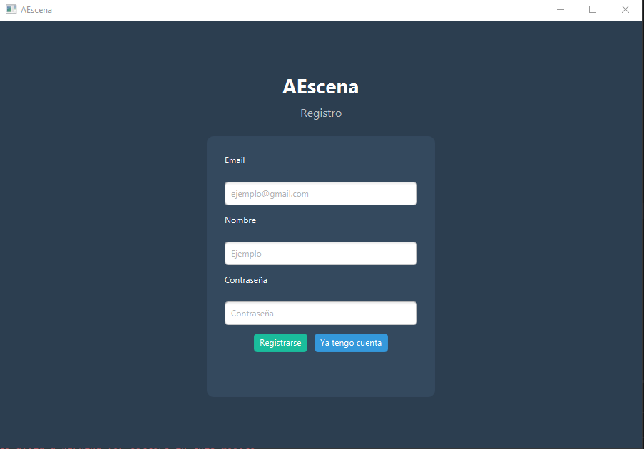
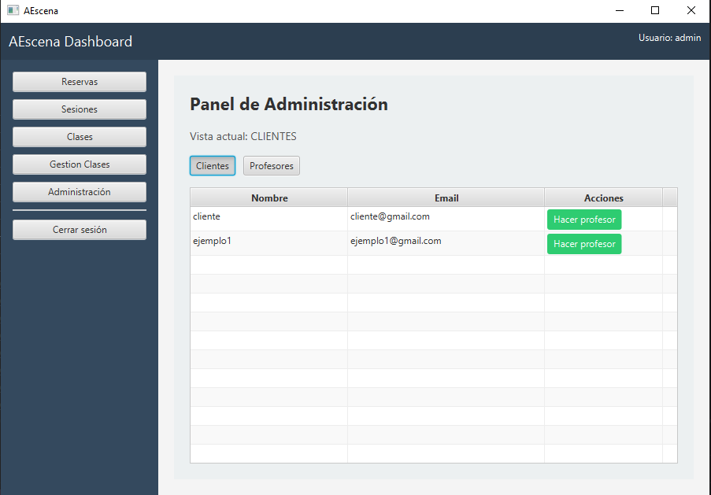
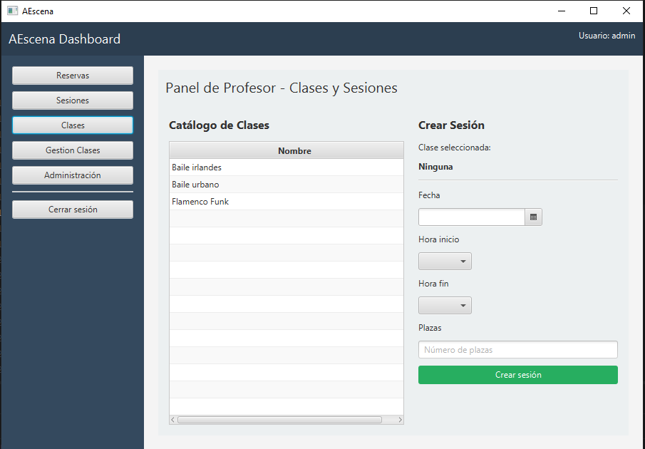

# AEscenaApp

## Descripción del proyecto

AEscenaApp es una aplicación de gestión de reservas de sesiones para una escuela de danza. Permite a distintos tipos de usuarios (clientes, profesores y administradores) interactuar con el sistema según su rol.

El sistema gestiona sesiones disponibles, reservas de usuarios y administración de clases y usuarios.

---

## Problema que resuelve

El proyecto soluciona la gestión manual de una empresa familiar pequeña así como la gestion de datos que aunque este informatizada es muy poco eficiente.

---

## Funcionalidades principales

- Login de Usuarios
- Registro de Usuarios controlando las entradas de datos con REGEX y dando el rol 'CLIENTE' por defecto 
- Capacidad del administrador de gestionar el rol de profesor
- Visualización de Usuarios separando 'CLIENTE' y 'PROFESOR' para el administrador
- Creación de moldes de Clases por parte del Usuario Admin
- Creación de Sesiones a partir de Clases por parte de Usuarios 'PROFESOR'
- Visualización de Sesiones creadas por un@ mismo para cada usuario 'PROFESOR'
- Creación de Reservas para los Usuarios 'CLIENTE'
- Visualización de Sesiones en las que tienes una Reserva como Usuario 'CLIENTE'

---

## Tecnologías utilizadas

- Java 21+
- JavaFX (interfaz gráfica)
- MySQL (base de datos)
- JDBC (conexión a base de datos)
- Arquitectura MVC (Modelo - Vista - Controlador)
- Patrón DAO (Data Access Object)

---
## Instalación y ejecución

### 1. Clonar el repositorio

Para obtener el proyecto, es necesario clonar el repositorio desde GitHub en el equipo local.

#### Pasos:

1. Crear una carpeta en el sistema donde se alojará el proyecto.
2. Abrir dicha carpeta en el explorador de archivos.
3. Abrir una terminal en esa ubicación:
   - En Windows, se puede escribir `cmd` en la barra de ruta del explorador o usar “Abrir en terminal”.

4. Ejecutar el siguiente comando:

```bash
git clone https://github.com/pollito96/proyectoIntermodular1DAM.git
```

---

### 2. Instalación y configuración de la base de datos

La aplicación utiliza MySQL como sistema de gestión de base de datos, por lo que es necesario disponer de un entorno de servidor local para su ejecución.

---

#### 2.1 Instalación de XAMPP

Para facilitar la gestión del servidor MySQL, se utiliza XAMPP como entorno local.

Pasos:

1. Descargar XAMPP desde su página oficial.
2. Instalar el paquete seleccionando los componentes:
   - Apache
   - MySQL
3. Iniciar el panel de control de XAMPP.
4. Activar los servicios de **Apache** y **MySQL**.

---

#### 2.2 Configuración de MySQL

Una vez iniciado MySQL en XAMPP:

1. Acceder a `http://localhost/phpmyadmin`.
2. Crear una nueva base de datos.
3. Importar los scripts SQL ubicados en el proyecto:
```
docs/BasesDeDatos/scripts/
```
Ejecutar en el siguiente orden:

- scriptsCreacionDB.sql → crea la estructura de la base de datos
- scriptsInsercionDB.sql → inserta datos de ejemplo 

#### 2.3 Verificación

Tras la importación, se debe comprobar que las tablas han sido creadas correctamente y que los datos se encuentran disponibles para la ejecución de la aplicación.

---

### 3. Configurar conexion a la base de datos

Asegúrate de ajustar los datos de conexión (usuario, contraseña, URL) en la clase de conexión del proyecto: ConnectionFactory.java
```
proyectoIntermodular1DAM/AEscenaApp/src/main/java/com/aescenaapp/dao/ConnectionFactory.java
```

#### Pasos de configuración:

1. Abrir el proyecto en un entorno de desarrollo (IDE) como IntelliJ IDEA o NetBeans.
2. Localizar la clase `ConnectionFactory.java`.
3. Modificar los siguientes parámetros según la configuración local de MySQL:
   - URL de conexión
   - Usuario de la base de datos
   - Contraseña

---
### 4. Ejecuta la aplicación

Ejecuta el proyecto desde tu IDE lanzando la clase: main.java
```
proyectoIntermodular1DAM/AEscenaApp/src/main/java/com/aescenaapp/main.java
```


## Estructura del proyecto

```
proyectoIntermodular1DAM/
├── AEscenaApp/
│   ├── src/
│   │   ├── main/
│   │       ├── java/
│   │       │   ├── com/
│   │       │   │   ├── aescenaapp/
│   │       │   │       ├── DTO/
│   │       │   │       │   └── SesionDTO.java
│   │       │   │       ├── controlador/
│   │       │   │       │   ├── AdminControlador.java
│   │       │   │       │   ├── ClasesAdminControlador.java
│   │       │   │       │   ├── ClasesProfeControlador.java
│   │       │   │       │   ├── IndexControlador.java
│   │       │   │       │   ├── LoginControlador.java
│   │       │   │       │   ├── RegistroControlador.java
│   │       │   │       │   ├── ReservaControlador.java
│   │       │   │       │   └── SesionControlador.java
│   │       │   │       ├── dao/
│   │       │   │       │   ├── ClaseDAO.java
│   │       │   │       │   ├── ConnectionFactory.java
│   │       │   │       │   ├── ReservaDAO.java
│   │       │   │       │   ├── SesionDAO.java
│   │       │   │       │   └── UsuarioDAO.java
│   │       │   │       ├── modelo/
│   │       │   │       │   ├── Clase.java
│   │       │   │       │   ├── Reserva.java
│   │       │   │       │   ├── Rol.java
│   │       │   │       │   ├── Sesion.java
│   │       │   │       │   └── Usuario.java
│   │       │   │       ├── servicio/
│   │       │   │       │   ├── ClaseServicio.java
│   │       │   │       │   ├── ExportServicio.java
│   │       │   │       │   ├── ReservaServicio.java
│   │       │   │       │   ├── SesionServicio.java
│   │       │   │       │   └── UsuarioServicio.java
│   │       │   │       ├── util/
│   │       │   │       │   ├── GestorNavegacion.java
│   │       │   │       │   ├── GestorSesion.java
│   │       │   │       │   ├── ValidacionUtil.java
│   │       │   │       │   └── XmlExport.java
│   │       │   │       └── main.java
│   │       │   └── module-info.java
│   │       ├── resources/
│   │           ├── com/
│   │               ├── aescenaapp/
│   │                   ├── adminPanel.fxml
│   │                   ├── clasesAdminPanel.fxml
│   │                   ├── clasesProfePanel.fxml
│   │                   ├── index.fxml
│   │                   ├── login.fxml
│   │                   ├── registro.fxml
│   │                   ├── reservaPanel.fxml
│   │                   └── sesionPanel.fxml
│   ├── target/
│   │   ├── classes/
│   │   │   ├── com/
│   │   │   │   ├── aescenaapp/
│   │   │   │       ├── DTO/
│   │   │   │       │   └── SesionDTO.class
│   │   │   │       ├── controlador/
│   │   │   │       │   ├── AdminControlador$1.class
│   │   │   │       │   ├── AdminControlador.class
│   │   │   │       │   ├── ClasesAdminControlador.class
│   │   │   │       │   ├── ClasesProfeControlador.class
│   │   │   │       │   ├── IndexControlador.class
│   │   │   │       │   ├── LoginControlador.class
│   │   │   │       │   ├── RegistroControlador.class
│   │   │   │       │   ├── ReservaControlador$1.class
│   │   │   │       │   ├── ReservaControlador.class
│   │   │   │       │   └── SesionControlador.class
│   │   │   │       ├── dao/
│   │   │   │       │   ├── ClaseDAO.class
│   │   │   │       │   ├── ConnectionFactory.class
│   │   │   │       │   ├── ReservaDAO.class
│   │   │   │       │   ├── SesionDAO.class
│   │   │   │       │   └── UsuarioDAO.class
│   │   │   │       ├── modelo/
│   │   │   │       │   ├── Clase.class
│   │   │   │       │   ├── Reserva.class
│   │   │   │       │   ├── Rol.class
│   │   │   │       │   ├── Sesion.class
│   │   │   │       │   └── Usuario.class
│   │   │   │       ├── servicio/
│   │   │   │       │   ├── ClaseServicio.class
│   │   │   │       │   ├── ExportServicio.class
│   │   │   │       │   ├── ReservaServicio.class
│   │   │   │       │   ├── SesionServicio.class
│   │   │   │       │   └── UsuarioServicio.class
│   │   │   │       ├── util/
│   │   │   │       │   ├── GestorNavegacion.class
│   │   │   │       │   ├── GestorSesion.class
│   │   │   │       │   ├── ValidacionUtil.class
│   │   │   │       │   └── XmlExport.class
│   │   │   │       ├── adminPanel.fxml
│   │   │   │       ├── clasesAdminPanel.fxml
│   │   │   │       ├── clasesProfePanel.fxml
│   │   │   │       ├── index.fxml
│   │   │   │       ├── login.fxml
│   │   │   │       ├── main.class
│   │   │   │       ├── registro.fxml
│   │   │   │       ├── reservaPanel.fxml
│   │   │   │       └── sesionPanel.fxml
│   │   │   └── module-info.class
│   │   ├── generated-sources/
│   │       ├── annotations/
│   ├── mvnw
│   ├── mvnw.cmd
│   └── pom.xml
├── docs/
│   ├── BasesDeDatos/
│   │   ├── diagrams/
│   │   │   ├── ModeloRelacional.TXT
│   │   │   ├── ModeloRelacional.png
│   │   │   ├── Modelo_ER.TXT
│   │   │   └── Modelo_ER.png
│   │   ├── scripts/
│   │   │   ├── scriptsConsultas.sql
│   │   │   ├── scriptsCreacionDB.sql
│   │   │   └── scriptsInsercionDB.sql
│   │   └── README.md
│   ├── Empleabilidad/
│   │   └── README.md
│   ├── MPO/
│   │   └── README.md
│   ├── Sistemas/
│   │   └── README.md
│   ├── assets/
│   │   ├── images/
│   │       ├── admin.PNG
│   │       ├── registro.PNG
│   │       └── sesiones.PNG
│   ├── xml/
│       ├── capturas_validacion/
│       │   ├── Validacion_Correcta.PNG
│       │   └── Validacion_Fallida.PNG
│       ├── exportaciones/
│       │   ├── 2026-04-27/
│       │       └── registro_sesiones_15-36-38.xml
│       ├── README.md
│       └── esquema.xsd
└── README.md

```

---

## Capturas

### Pantalla de registro



### Panel de administración



### Gestión de sesiones 


