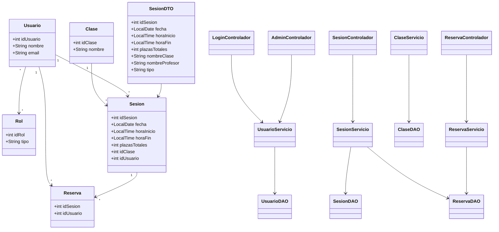

# MPO

## Arquitectura del proyecto

El proyecto sigue una arquitectura en capas basada en MVC ampliado, separando claramente la interfaz, la lógica de negocio y el acceso a datos.

- **Controladores**: gestionan la interfaz JavaFX y la interacción con el usuario (LoginControlador, SesionControlador, etc.).
- **Servicios**: contienen la lógica de negocio y validaciones (SesionServicio, UsuarioServicio, etc.).
- **DAO**: realizan el acceso a la base de datos mediante JDBC (SesionDAO, UsuarioDAO, ReservaDAO).
- **Modelos**: representan las entidades del sistema (Usuario, Sesion, Reserva, Clase).
- **DTO**: se utilizan para transportar datos combinados entre capas (SesionDTO).
- **Utilidades**: clases auxiliares como gestión de sesión, navegación y validaciones.

---

## Diagrama

---

## Mejora de MPO

Comencé el desarrollo planteandome hacer la lógica en capas sin embargo, añadí tambien un sitema de validación de datos para el XML, ya que nos lo pedían tambien en lenguaje de marcas con un XSD, y validación tanto dentro del registro de los usuarios, como en la creación de las sesiones.

También he creado un sistema de menús dinamicos dependiendo del rol del usuario que este loggeado.
 
Y por último también utilicé gestion de estados, ya desde el planteamiento de la base de datos variando en caso de si su cuenta está o no activa